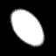

# PCAAE : Principal Component Analysis Autoencoder


The 1st axis: Ellipse area    |  The 2nd axis: Horizontal and vertical radius  | The 3rd axis: two diagonal directions
:-------------------------:|:-------------------------:|:-------------------------:
  |   |  

**Figure 1:** *Interpolation in the latent space of PCAAE for ellipse images.*

The 1st axis: Hair colour   |  The 2nd axis: Head pose   | The 3rd axis: Gender
:-------------------------:|:-------------------------:|:-------------------------:
  |   |  

**Figure 2:** *Interpolation in the latent space of PCAAE for the latent space of PGAN.*

[[Preprint](https://arxiv.org/pdf/1904.01277.pdf)]
[[Preprint](https://arxiv.org/pdf/2006.07827.pdf)]
[[Project Page](https://github.com/chieupham/PCAAE/)]

## Prior Work

We would like to first introduce the state-of-the-art GAN model used in this work : ProgressiveGAN or PGAN (Karras *el al.*, ICLR 2018). This models achieves high-quality face synthesis by learning unconditional GANs. For more details about this models please refer to the original paper, as well as the official implementations.

* *ProgressiveGAN*:
  [[Paper](https://arxiv.org/pdf/1710.10196.pdf)]
  [[Code](https://github.com/tkarras/progressive_growing_of_gans)]

In addition, we would like to introduce the state-of-the-art Disentangled VAE used for comparing in this work : 

* *Standard VAE Loss* from [Auto-Encoding Variational Bayes](https://arxiv.org/abs/1312.6114)
* *β-VAE<sub>H</sub>* from [β-VAE: Learning Basic Visual Concepts with a Constrained Variational Framework](https://openreview.net/pdf?id=Sy2fzU9gl)
* *β-VAE<sub>B</sub>* from [Understanding disentangling in β-VAE](https://arxiv.org/abs/1804.03599)
* *FactorVAE* from [Disentangling by Factorising](https://arxiv.org/abs/1802.05983)
* *β-TCVAE* from [Isolating Sources of Disentanglement in Variational Autoencoders](https://arxiv.org/abs/1802.04942)

  [[Code of these methods](https://github.com/YannDubs/disentangling-vae)]

We also compare our method with StyleGAN:

* *StyleGAN*:
  [[Paper](https://arxiv.org/pdf/1812.04948.pdf)]
  [[Code](https://github.com/NVlabs/stylegan)]

## Demo code

We show our model in [[Colab Jupyter Notebook](https://colab.research.google.com/github/chieupham/PCAAE/blob/main/Introduction_PCAAE.ipynb/)]

Or we can test our model and the compared methods through:

```bash
python demo/test_pca_ae_ellipses.py
```

```bash
python demo/test_pca_pgan.py
```

## BibTeX

```bibtex
@article{ladjal2019pca,
  title={A PCA-like autoencoder},
  author={Ladjal, Sa{\"\i}d and Newson, Alasdair and Pham, Chi-Hieu},
  journal={arXiv preprint arXiv:1904.01277},
  year={2019}
}
@article{pham2020pcaae,
  title={PCAAE: Principal Component Analysis Autoencoder for organising the latent space of generative networks},
  author={Pham, Chi-Hieu and Ladjal, Sa{\"\i}d and Newson, Alasdair},
  journal={arXiv preprint arXiv:2006.07827},
  year={2020}
}
```
